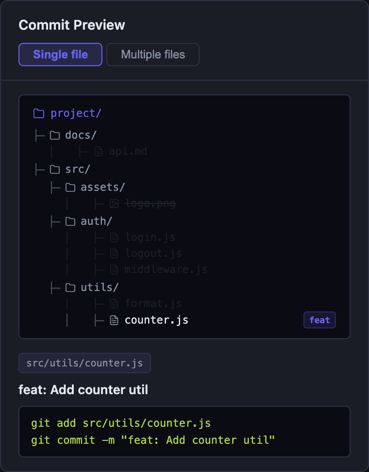
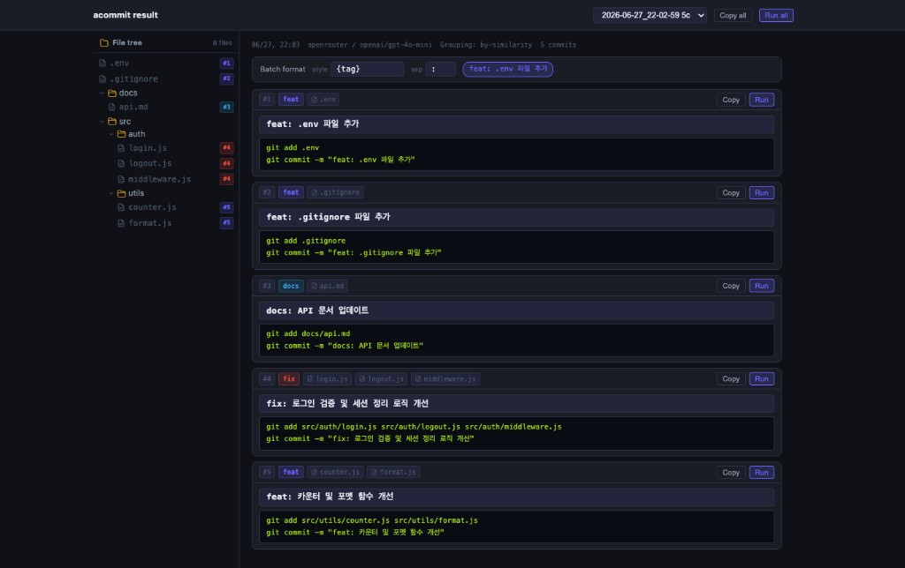
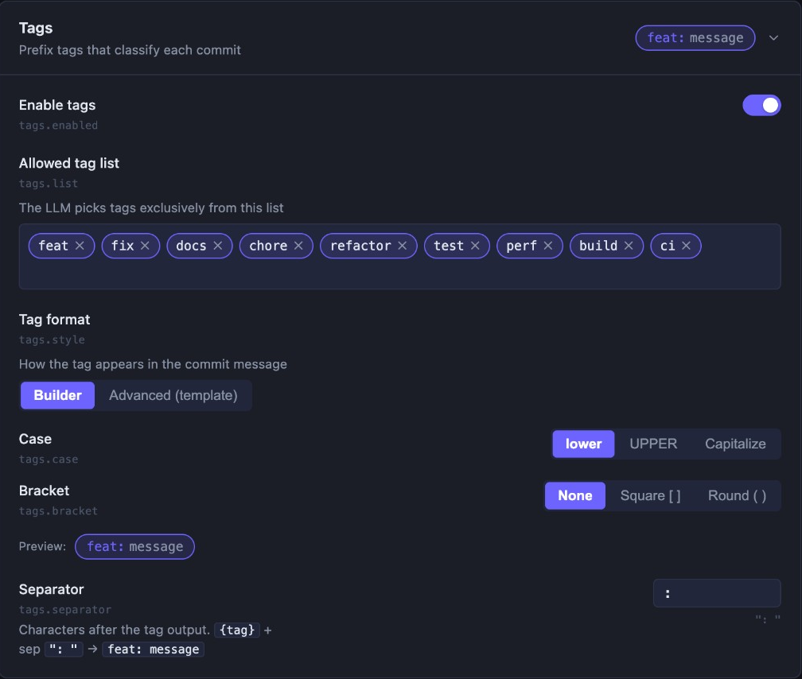
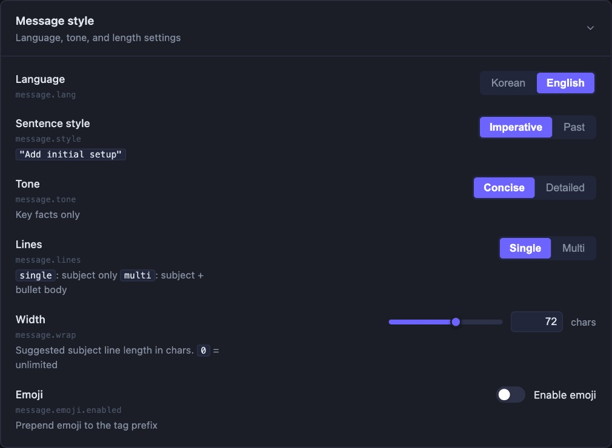
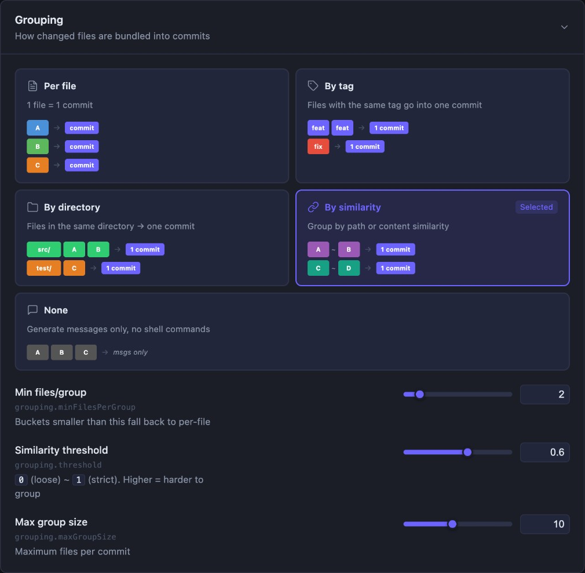
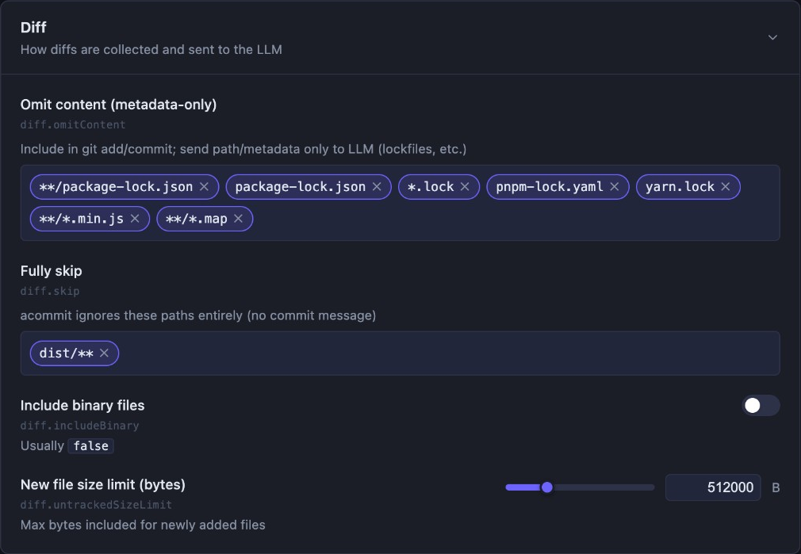
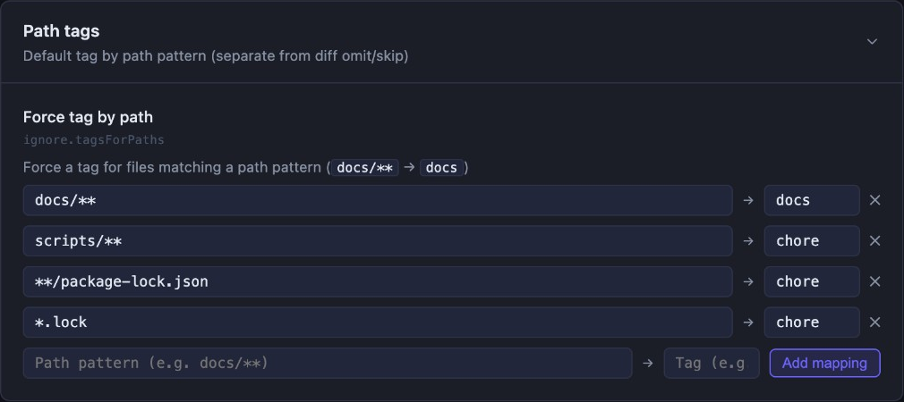
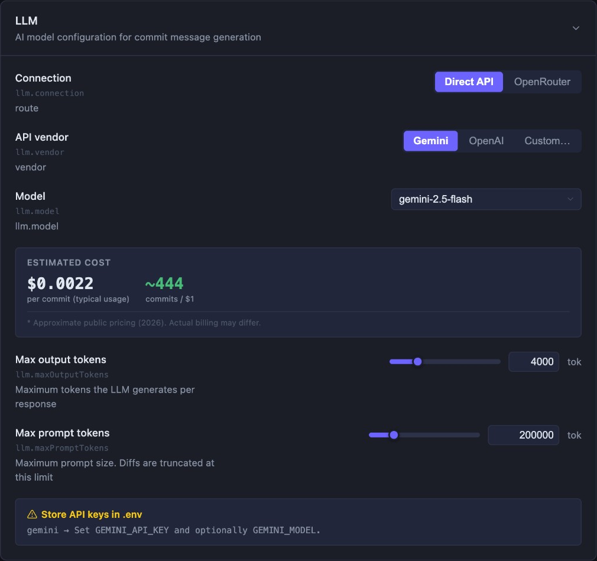
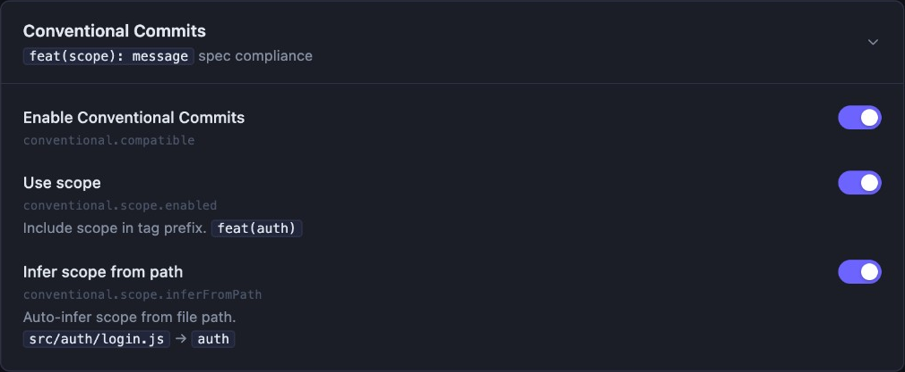

# acommit — AI Commit Message Automation CLI

A CLI tool that analyzes git diffs and automatically generates **consistent commit messages** based on your team's conventions.

<br />

## 1. Installation

### 1) Install

#### via npm

```bash
npm install -g acommit
```

#### from source

```bash
git clone https://github.com/seungjoonH/acommit.git
cd acommit
npm install
npm link
```

### 2) Set Environment Variables (API Keys)

Create a `.env` file in the project root and add your API key for the provider you want to use.

```
ACOMMIT_GEMINI_API_KEY=your_key_here
ACOMMIT_OPENAI_API_KEY=your_key_here
ACOMMIT_OPENROUTER_API_KEY=your_key_here
```

> [!WARNING]
> Make sure to add `.env` to `.gitignore` to prevent exposing your API keys!

### 3) Create Rules File

```bash
acommit init          # Create .acommit/rules.yml from template
```

### 4) Run

```bash
acommit commit
```

Results are saved to `.acommit/results/commits/`.

<br />

## 2. Available Commands

| Command | Description | Example |
| --- | --- | --- |
| `acommit commit` | Analyze current changes (git diff) and draft commit messages. | `acommit commit` |
| `acommit prompt [--save]` | Add a helper prompt (one-time or persistent). | `acommit prompt -m "Highlight refactoring"` |
| `acommit model` | Select the LLM backend to use. | `acommit model -p openrouter` |
| `acommit init` | Create `.acommit/rules.yml` and update `.gitignore`. | `acommit init --lang en` |
| `acommit rules` | Open the rules editor UI in your browser. | `acommit rules` |
| `acommit result` | Open the commit result viewer in your browser. | `acommit result` |
| `acommit locale` | Set the CLI/UI display language (`ko` \| `en`). | `acommit locale en` |
| `acommit --help` | Display CLI help with global options. | `acommit --help` |

### `acommit commit`

```sh
acommit commit
```

Analyzes current changes (`git diff`) and drafts **commit message summaries**. After completion, the result viewer opens automatically in your browser. Press `Ctrl+C` to stop the server.


### `acommit prompt`

```sh
acommit prompt [options]
```

Provides **additional instructions** to the LLM to influence the generated output. Instructions can be used **one-time** or saved **persistently**.

#### Options

| Option | Description | Type |
| :--- | :--- | :--- |
| `-m, --message <msg>` | Provide the prompt inline (skips editor). | optional |
| `--save` | Persist the prompt in `.acommit/rules.yml`. | optional |

#### Flow

1.  By default, `vi` opens for writing instructions.
2.  Without `--save`, the prompt is stored temporarily for the next run only.
3.  With `--save`, the prompt is appended to the config file for repeated use.


### `acommit model`

```sh
acommit model [options]
```

Select the **LLM backend** for commit message generation.

#### Options

| Option | Description | Type |
| :--- | :--- | :--- |
| `-p, --provider <name>` | Directly set the LLM provider (`gemini` \| `openai` \| `openrouter`). | optional |
| `-m, --model <id>` | Specify the model ID directly (e.g. `gemini-2.5-flash`, `google/gemini-2.5-flash`). | optional |

#### Flow

1.  Reads the currently configured LLM provider.
2.  Overwrites with the new selection (interactive picker if no option given).
3.  Prints a reminder about required environment variables.


### `acommit init`

```sh
acommit init [options]
```

Creates the `.acommit/rules.yml` config file and updates `.gitignore` to exclude the generated directory.

#### Options

| Option | Description | Type |
| :--- | :--- | :--- |
| `--lang <code>` | Language code for the `.acommit/rules.yml` template. (`en` or `ko`, default `ko`) | optional |

#### Flow

1.  If `rules.yml` does not exist, copies the template to create it.
2.  Adds `.acommit/` to `.gitignore` if not already present.


### `acommit rules`

```sh
acommit rules [options]
```

Opens the **rules editor** in your browser — a visual editor for `.acommit/rules.yml`.

- **Left panel** — seven sections: Tags, Message style, Conventional Commits, Grouping, LLM, Path tags, and Diff. Each maps directly to a `rules.yml` key (see §3).
- **Right panel** — **Commit Preview**: a sample file tree and commit messages that update as you change settings (grouping mode, tags, diff rules, and more).
- **Save** writes to `.acommit/rules.yml` (previous version saved as `.acommit/rules.yml.bak`).
- **UI language** follows `.acommit/locale` (`acommit locale en` \| `ko`), separate from `message.lang` (the language of generated commit text).

#### Options

| Option | Description | Type |
| :--- | :--- | :--- |
| `-p, --port <number>` | Local server port (default `3000`). | optional |
| `--no-open` | Do not open a browser tab automatically. | optional |

#### Rules editor sections

| GUI section | `rules.yml` key | Screenshot |
| :--- | :--- | :--- |
| Tags | `tags` | [below §3.1](#1-tags) |
| Message style | `message` | [below §3.2](#2-message) |
| Grouping | `grouping` | [below §3.3](#3-grouping) |
| Diff | `diff` | [below §3.4](#4-diff) |
| Path tags | `ignore.tagsForPaths` | [below §3.5](#5-ignore) |
| LLM | `llm` | [below §3.6](#6-llm) |
| Conventional Commits | `conventional` | [below §3.7](#7-conventional) |

**Commit Preview** (right panel) — sample output follows `message.lang` and grouping settings:




### `acommit result`

```sh
acommit result [options]
```

Opens the **commit result viewer** in your browser. Browse the latest session's generated commits, edit subjects, and run them as actual `git commit` commands.



#### Options

| Option | Description | Type |
| :--- | :--- | :--- |
| `-p, --port <number>` | Local server port (default `3000`). | optional |
| `--no-open` | Do not open a browser tab automatically. | optional |


### `acommit locale`

```sh
acommit locale [lang]
```

Sets the **display language** for CLI output and the result viewer UI. The setting is persisted in `.acommit/locale`.

#### Arguments

| Argument | Description | Type |
| :--- | :--- | :--- |
| `[lang]` | Language code to set directly (`ko` \| `en`). Omit to use the interactive picker. | optional |


### `acommit --help`

```sh
acommit --help
```

Displays **global options and available commands** for the `acommit` CLI.

<br />

## 3. `.acommit/rules.yml` Configuration Guide

The `.acommit/rules.yml` file defines the **behavior** and **commit message style** of `acommit`.

> [!TIP]
> Run `acommit rules` to edit every section below in the browser. Screenshots show the English UI; field names match the YAML keys.


### 1. `tags`



| Key | Description | Type | Default |
| :--- | :--- | :--- | :--- |
| `enabled` | Whether to use tags | `boolean` | `true` |
| `list` | Allowed tag list | `array` | `[feat, fix, docs, chore, refactor, test, perf, build, ci]` |
| `style` | Tag format template | `string` | (see below) |
| `separator` | String appended after the tag | `string` | `": "` |
| `case` | Tag letter case | `string` | `"lower"` (`lower` \| `upper` \| `capitalize`) |
| `bracket` | Bracket wrapping the tag | `string` | `"none"` (`none` \| `square` \| `round`) |

If `style` is not set, it is derived automatically from `case` + `bracket`. Default output: `feat: message`.

> **`style` placeholders** (when set explicitly):
> * `{tag}` → lowercase (`feat`)
> * `{TAG}` → uppercase (`FEAT`)
> * `{Tag}` → capitalized (`Feat`)
> * `{scope}` → scope value when `conventional.scope.enabled: true`
> * `{sep}` → the `separator` value


### 2. `message`



| Key | Description | Type | Default |
| :--- | :--- | :--- | :--- |
| `lang` | Language for generated messages | `string` | `"ko"` (`ko` \| `en`) |
| `style` | Sentence style | `string` | `"verb"` (see below) |
| `tone` | Message length | `string` | `"concise"` (`concise` \| `detailed`) |
| `lines` | Number of subject lines | `string` | `"single"` (`single` \| `multi`) |
| `wrap` | Subject length guideline in characters (no hard wrap) | `integer` | `72` |

`style` options depend on `lang`:
- `lang: en` → `imperative` \| `past`
- `lang: ko` → `verb` \| `declarative`

#### `message.emoji`

| Key | Description | Type | Default |
| :--- | :--- | :--- | :--- |
| `enabled` | Whether to prepend emojis to tags | `boolean` | `false` |
| `map` | Tag-to-emoji mapping | `map` | `{}` |


### 3. `grouping`



| Key | Description | Type | Default |
| :--- | :--- | :--- | :--- |
| `mode` | How files are grouped into commits | `string` | `"per-file"` |
| `directoryDepth` | Directory depth for `by-directory` mode | `integer` | `1` |
| `minFilesPerGroup` | Groups smaller than this fall back to `per-file` | `integer` | `2` |
| `threshold` | Similarity cutoff for `by-similarity` (0–1) | `float` | `0.6` |

**`mode` options:**
- `per-file` — one commit per file (default)
- `by-tag` — group files that share the same tag
- `by-directory` — group by directory path
- `by-similarity` — group by content and path similarity
- `none` — no grouping strategy (behaves the same as `per-file`)


### 4. `diff`



| Key | Description | Type | Default |
| :--- | :--- | :--- | :--- |
| `includeBinary` | Include binary file contents in the diff | `boolean` | `false` |
| `untrackedSizeLimit` | Max bytes for new file content sent to LLM (truncated beyond) | `integer` | `512000` |
| `omitContent` | Glob patterns whose diff body is omitted from LLM input (file is still committed) | `array` | `[package-lock.json, *.lock, ...]` |
| `skip` | Glob patterns fully excluded from acommit (no commit message generated) | `array` | `[dist/**]` |


### 5. `ignore` (path tags)

Shown as **Path tags** in the GUI. YAML key: `ignore.tagsForPaths`.



| Key | Description | Type | Default |
| :--- | :--- | :--- | :--- |
| `tagsForPaths` | Force a tag for files matching a glob pattern | `map` | see below |

**Default mappings:**

```yaml
ignore:
  tagsForPaths:
    "docs/**": "docs"
    "scripts/**": "chore"
    "**/package-lock.json": "chore"
    "*.lock": "chore"
    "pnpm-lock.yaml": "chore"
    "yarn.lock": "chore"
```


### 6. `llm`



| Key | Description | Type | Default |
| :--- | :--- | :--- | :--- |
| `provider` | LLM provider | `string` | `"gemini"` (`gemini` \| `openai` \| `openrouter`) |
| `model` | Model name | `string` | `"gemini-2.5-flash"` |
| `maxPromptTokens` | Prompt token cap | `integer` | `200000` |
| `maxOutputTokens` | Output token cap | `integer` | `4000` |

> [!TIP]
> Run `acommit model` to select a provider and model interactively — it saves directly to `rules.yml`.


### 7. `conventional`



| Key | Description | Type | Default |
| :--- | :--- | :--- | :--- |
| `compatible` | Follow the Conventional Commits spec | `boolean` | `false` |

#### `conventional.scope`

| Key | Description | Type | Default |
| :--- | :--- | :--- | :--- |
| `enabled` | Append scope to the tag (e.g. `feat(api):`) | `boolean` | `false` |
| `inferFromPath` | Auto-infer scope from file path | `boolean` | `true` |

> **Example**: `compatible: true`, `scope.enabled: true`, `tags.style: "{tag}({scope}):"` → `feat(api): message`

> [!TIP]
> Commit `rules.yml` to your repo so every team member shares the same conventions.

<br />

## 4. Environment Variables & API Keys

> [!NOTE]
> Provider and model are configured in `.acommit/rules.yml` under the `llm` section. Only API keys go in `.env`.

### 1) `.env` Template

See `.env.sample`

```
ACOMMIT_GEMINI_API_KEY=
ACOMMIT_OPENAI_API_KEY=
ACOMMIT_OPENROUTER_API_KEY=
```

### 2) API Keys

  - **Gemini (Google AI Studio)**

    1.  Visit [Google AI Studio](https://makersuite.google.com/).
    2.  Generate an API key and save it as `ACOMMIT_GEMINI_API_KEY`.

  - **OpenAI**

    1.  Visit [OpenAI Dashboard](https://platform.openai.com/).
    2.  Save your key as `ACOMMIT_OPENAI_API_KEY`.

  - **OpenRouter**

    1.  Visit [OpenRouter](https://openrouter.ai/).
    2.  Save your key as `ACOMMIT_OPENROUTER_API_KEY`.
    3.  Set `llm.provider: openrouter` and `llm.model: google/gemini-2.5-flash` (or any supported model) in `rules.yml`.

<br />

## 5. License

MIT License © 2025 — SeungjoonH.
Free to use, modify, and distribute as long as attribution is preserved.

<br />

## 6. Open Source

This project is open source and welcomes contributions from anyone.  
Bug fixes, feature proposals, documentation improvements, and code refactoring — all forms of **Pull Requests** are welcome.
