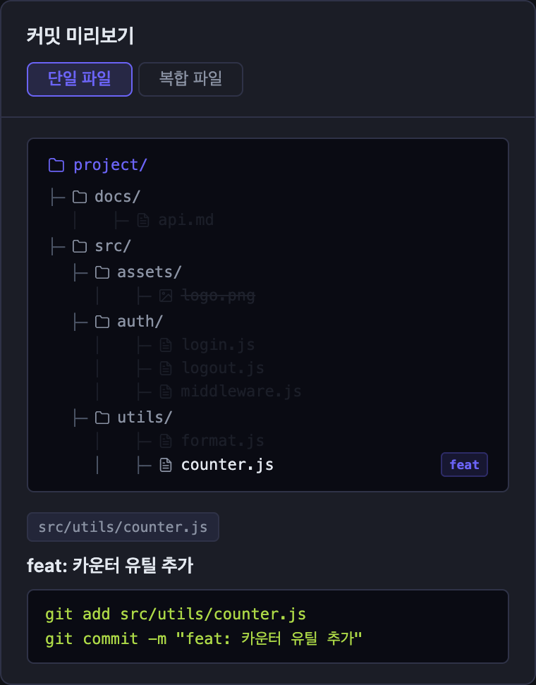
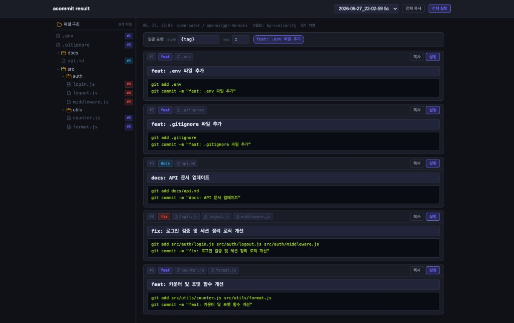
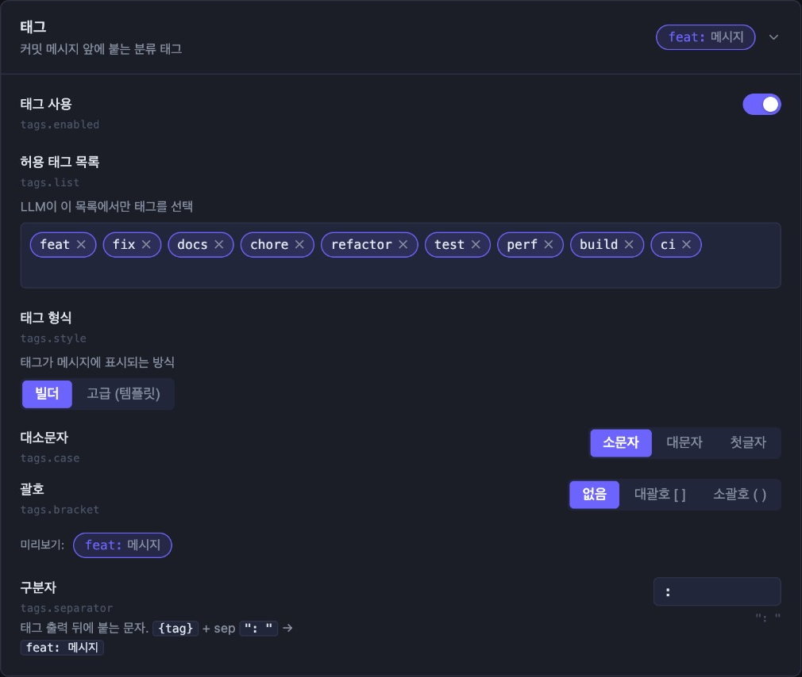
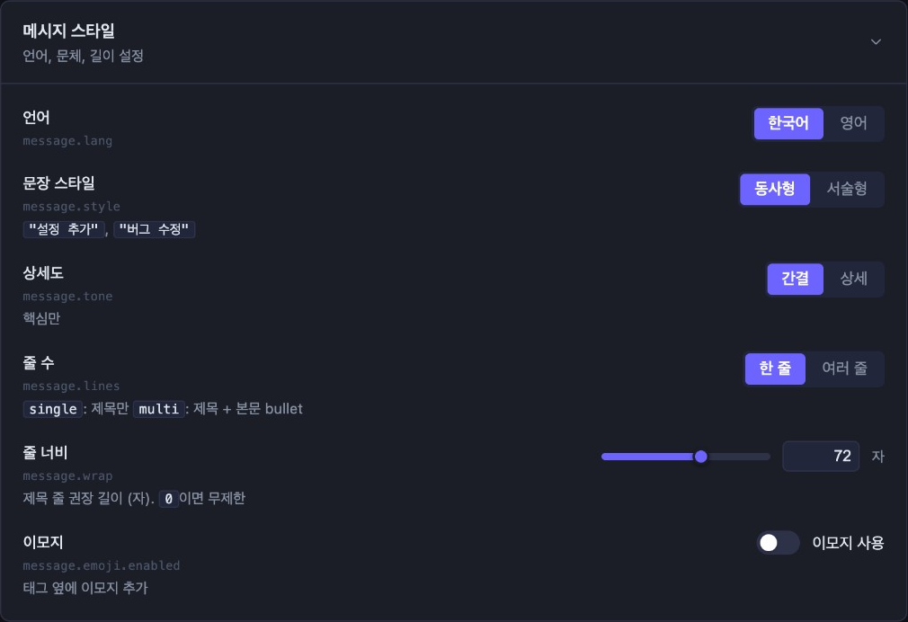
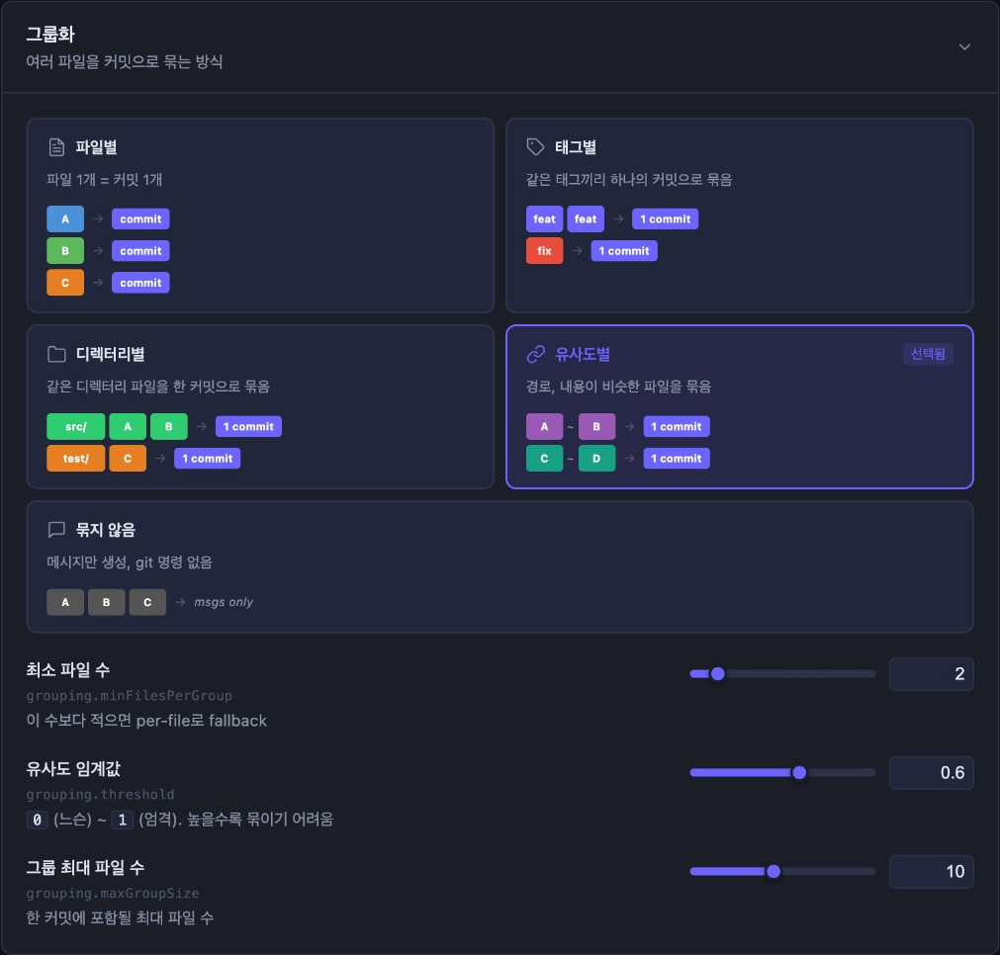
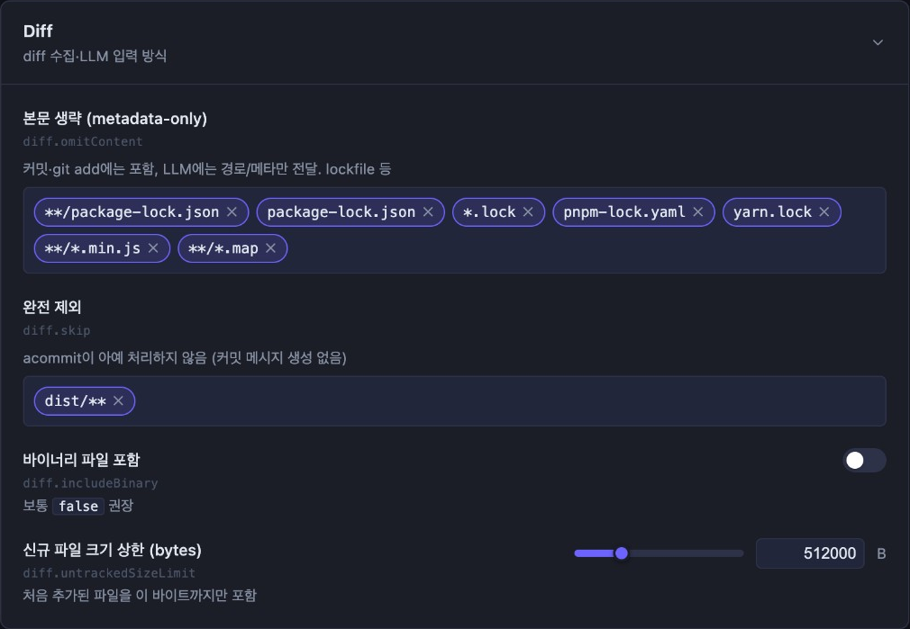
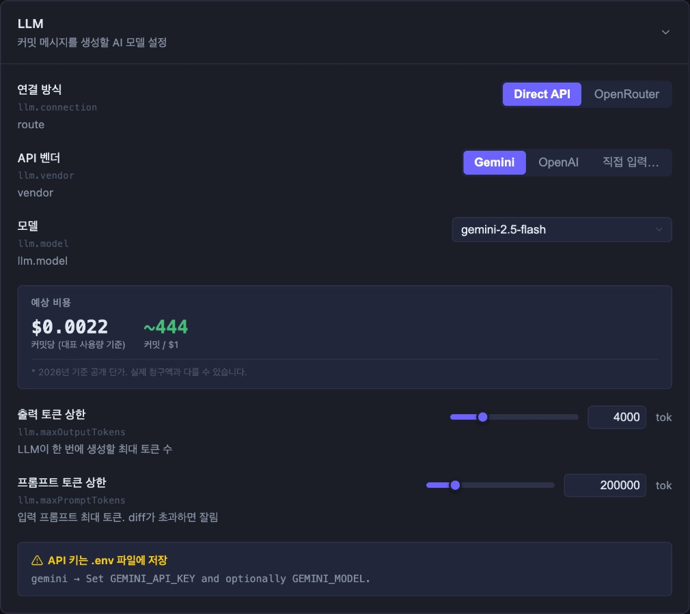
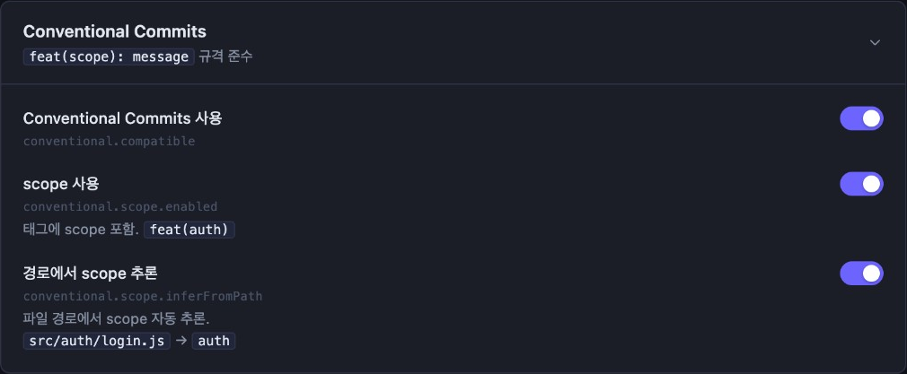

# acommit — AI 커밋 메시지 자동화 CLI

Git diff를 분석하여 팀 컨벤션에 맞는 **일관된 커밋 메시지**를 자동 생성하는 CLI 도구입니다.

<br />

## 1. 설치 방법

### 1) 설치

#### npm 설치

```bash
npm install -g acommit
```

#### 소스에서 설치

```bash
git clone https://github.com/seungjoonH/acommit.git
cd acommit
npm install
npm link
```

### 2) 환경 변수 설정 (API 키)

프로젝트 루트에 `.env` 파일을 생성하고 사용할 프로바이더의 API 키를 입력합니다.

```
ACOMMIT_GEMINI_API_KEY=your_key_here
ACOMMIT_OPENAI_API_KEY=your_key_here
ACOMMIT_OPENROUTER_API_KEY=your_key_here
```

> [!WARNING]
> `.env`를 반드시 `.gitignore`에 추가하세요. `acommit commit`은 민감한 `.env` 계열 파일이 커밋 후보에 있으면 diff 내용을 읽기 전에 중단하고 `.gitignore` 보호 규칙 추가 여부를 확인합니다.

### 3) 규칙 파일 생성

```bash
acommit init          # 템플릿으로부터 .acommit/rules.yml 생성
```

### 4) 실행

```bash
acommit commit
```

결과는 `.acommit/results/commits/` 에 저장됩니다.

<br />

## 2. 사용 가능한 명령어

| 명령어 | 설명 | 예시 |
| --- | --- | --- |
| `acommit commit` | 현재 변경사항 (git diff) 를 토대로 commit 요약 초안을 작성합니다. | `acommit commit` |
| `acommit prompt [--save]` | 보조 프롬프트(일회성 또는 영구적)를 추가합니다. | `acommit prompt -m "Highlight refactoring"` |
| `acommit model` | 사용할 LLM 백엔드를 선택합니다. | `acommit model -p openrouter` |
| `acommit init` | `.acommit/rules.yml`을 생성하고 `.gitignore`를 업데이트합니다. | `acommit init --lang ko` |
| `acommit rules` | 브라우저에서 `.acommit/rules.yml`을 편집하는 UI를 엽니다. | `acommit rules` |
| `acommit result` | 커밋 결과를 브라우저 UI로 확인하고 실행합니다. | `acommit result` |
| `acommit locale` | CLI/UI 언어를 설정합니다 (`ko` \| `en`). | `acommit locale ko` |
| `acommit --help` | 전역 옵션과 함께 CLI 도움말을 표시합니다. | `acommit --help` |

### `acommit commit`

```sh
acommit commit
```

현재 변경사항 (`git diff`)을 분석하여 **커밋 요약 초안**을 작성합니다. 완료 후 결과 뷰어가 자동으로 브라우저에 열립니다. `Ctrl+C`로 서버를 종료합니다.

민감 정보와 생성 산출물은 기본적으로 안전하게 처리합니다.

- `.env`, `.env.local`, `.env.production` 등 민감한 환경 파일은 diff 수집 전에 감지하고 중단합니다.
- `.env.example`, `.env.sample`, `.env.template` 같은 공유용 템플릿 파일은 허용합니다.
- `node_modules` / `.pnpm` 경로는 `.gitignore` 설정과 무관하게 커밋 후보에서 제외합니다.


### `acommit prompt`

```sh
acommit prompt [options]
```

LLM에 **추가 지침**을 제공하여 생성 결과에 반영합니다. 지침은 **일회성**으로 사용하거나 **영구적**으로 저장할 수 있습니다.

#### 옵션

| 옵션 | 설명 | 유형 |
| :--- | :--- | :--- |
| `-m, --message <msg>` | 인라인 텍스트로 **프롬프트 메시지**를 제공합니다. (에디터 실행 건너뛰기) | optional |
| `--save` | 프롬프트를 `.acommit/rules.yml`에 **영구적으로 저장**합니다. | optional |

#### 흐름

1.  기본적으로 `vi` 가 실행되어 지침을 작성할 수 있습니다.
2.  `--save` 옵션이 없으면 다음 실행에 대해서만 임시로 저장됩니다.
3.  `--save` 옵션이 있으면 반복 사용을 위해 설정 파일에 추가됩니다.


### `acommit model`

```sh
acommit model [options]
```

커밋 메시지 생성에 사용할 **LLM 백엔드**를 선택합니다.

#### 옵션

| 옵션 | 설명 | 유형 |
| :--- | :--- | :--- |
| `-p, --provider <name>` | 사용할 LLM 제공자 (`gemini` \| `openai` \| `openrouter`)를 직접 선택합니다. | optional |
| `-m, --model <id>` | 모델 ID를 직접 지정합니다. (예: `gemini-2.5-flash`, `google/gemini-2.5-flash`) | optional |

#### 흐름

1.  현재 설정된 LLM 제공자를 읽습니다.
2.  새 선택 항목으로 덮어씁니다. (옵션 미지정 시 대화형 선택기 사용)
3.  필요한 **환경 변수** 설정에 대한 알림을 출력합니다.


### `acommit init`

```sh
acommit init [options]
```

`acommit` 설정을 위한 기본 파일인 `.acommit/rules.yml`을 생성하고, 생성된 파일이 커밋되지 않도록 `.gitignore` 파일을 업데이트합니다.

#### 옵션

| 옵션 | 설명 | 유형 |
| :--- | :--- | :--- |
| `--lang <code>` | `.acommit/rules.yml` 템플릿의 언어 코드를 지정합니다. (`en` 또는 `ko`, 기본값 `ko`) | optional |

#### 흐름

1.  `rules.yml`이 없으면 템플릿을 복사하여 생성합니다.
2.  `.gitignore`에 `.acommit/` 또는 `.acommit/results/` 항목이 없으면 선택한 설정에 따라 추가합니다.


### `acommit rules`

```sh
acommit rules [options]
```

브라우저에서 `.acommit/rules.yml`을 편집하는 **규칙 편집 UI**를 엽니다.

- **좌측 패널** — Tags, 메시지 스타일, Conventional Commits, 그룹화, LLM, **경로별 태그**, Diff 7개 섹션. 각각 `rules.yml` 키와 1:1 대응합니다 (§3 참고).
- **우측 패널** — **커밋 미리보기**: 샘플 파일 트리와 커밋 메시지가 설정 변경에 따라 실시간으로 바뀝니다.
- **저장** 시 `.acommit/rules.yml`에 반영됩니다 (이전 버전은 `.acommit/rules.yml.bak`).
- **UI 언어**는 `.acommit/locale` 기준 (`acommit locale ko` \| `en`). 커밋 메시지 언어(`message.lang`)와는 별개입니다.

#### 옵션

| 옵션 | 설명 | 유형 |
| :--- | :--- | :--- |
| `-p, --port <number>` | 로컬 서버 포트 (기본값 `3000`) | optional |
| `--no-open` | 브라우저 탭을 자동으로 열지 않습니다. | optional |

#### 규칙 편집기 섹션

| GUI 섹션 | `rules.yml` 키 | 스크린샷 |
| :--- | :--- | :--- |
| 태그 | `tags` | [아래 §3.1](#1-tags-커밋-태그-설정) |
| 메시지 스타일 | `message` | [아래 §3.2](#2-message-메시지-설정) |
| 그룹화 | `grouping` | [아래 §3.3](#3-grouping-커밋-그룹화) |
| Diff | `diff` | [아래 §3.4](#4-diff-diff-처리) |
| 경로별 태그 | `ignore.tagsForPaths` | [아래 §3.5](#5-ignore-경로별-태그) |
| LLM | `llm` | [아래 §3.6](#6-llm-llm-설정) |
| Conventional Commits | `conventional` | [아래 §3.7](#7-conventional-conventional-commits) |

**커밋 미리보기** (우측 패널) — `message.lang`·그룹화 설정에 따라 샘플 출력이 바뀝니다:




### `acommit result`

```sh
acommit result [options]
```

가장 최근 `acommit commit` 실행 결과를 브라우저 UI로 확인하고, 각 커밋을 실제 `git commit`으로 실행할 수 있습니다.



#### 옵션

| 옵션 | 설명 | 유형 |
| :--- | :--- | :--- |
| `-p, --port <number>` | 로컬 서버 포트 (기본값 `3000`) | optional |
| `--no-open` | 브라우저 탭을 자동으로 열지 않습니다. | optional |


### `acommit locale`

```sh
acommit locale [lang]
```

CLI 출력 및 결과 뷰어 UI의 **표시 언어**를 설정합니다. 설정은 `.acommit/locale` 파일에 저장됩니다.

#### 인수

| 인수 | 설명 | 유형 |
| :--- | :--- | :--- |
| `[lang]` | 언어 코드를 직접 지정합니다 (`ko` \| `en`). 생략 시 대화형 선택기가 실행됩니다. | optional |


### `acommit --help`

```sh
acommit --help
```

`acommit` CLI의 **전역 옵션과 사용 가능한 명령어 목록**을 표시합니다.

<br />

## 3. `.acommit/rules.yml` 설정 가이드

`.acommit/rules.yml` 파일은 `acommit` CLI의 **동작 방식**과 **커밋 메시지 스타일**을 정의합니다.

> [!TIP]
> `acommit rules`로 아래 모든 항목을 브라우저에서 편집할 수 있습니다. 스크린샷은 한국어 UI이며, 필드명은 YAML 키와 동일합니다.


### 1. `tags` (커밋 태그 설정)



| 키 | 설명 | 유형 | 기본값 |
| :--- | :--- | :--- | :--- |
| `enabled` | 태그 사용 여부 | `boolean` | `true` |
| `list` | 허용 태그 목록 | `array` | `[feat, fix, docs, chore, refactor, test, perf, build, ci]` |
| `style` | 태그 출력 형식 템플릿 | `string` | (아래 참조) |
| `separator` | 태그 뒤에 붙는 구분자 | `string` | `": "` |
| `case` | 태그 대소문자 | `string` | `"lower"` (`lower` \| `upper` \| `capitalize`) |
| `bracket` | 태그를 감싸는 괄호 | `string` | `"none"` (`none` \| `square` \| `round`) |

`style`을 직접 지정하지 않으면 `case`와 `bracket` 조합으로 자동 결정됩니다. (기본 출력: `feat: 메시지`)

> **`style` 플레이스홀더** (직접 지정할 때):
> * `{tag}` → 소문자 (`feat`)
> * `{TAG}` → 대문자 (`FEAT`)
> * `{Tag}` → 첫 글자 대문자 (`Feat`)
> * `{scope}` → `conventional.scope.enabled: true`일 때 스코프 값
> * `{sep}` → `separator` 값


### 2. `message` (메시지 설정)



| 키 | 설명 | 유형 | 기본값 |
| :--- | :--- | :--- | :--- |
| `lang` | 생성할 메시지의 언어 | `string` | `"ko"` (`ko` \| `en`) |
| `style` | 문장 스타일 | `string` | `"verb"` (아래 참조) |
| `tone` | 메시지 길이 | `string` | `"concise"` (`concise` \| `detailed`) |
| `lines` | 메시지 줄 수 | `string` | `"single"` (`single` \| `multi`) |
| `wrap` | 제목 줄 길이 가이드라인 (강제 줄바꿈 아님) | `integer` | `72` |

`style` 옵션은 `lang`에 따라 달라집니다:
- `lang: ko` → `verb` (동사형) \| `declarative` (서술형)
- `lang: en` → `imperative` (명령형) \| `past` (과거형)

#### `message.emoji`

| 키 | 설명 | 유형 | 기본값 |
| :--- | :--- | :--- | :--- |
| `enabled` | 태그별 이모지 사용 여부 | `boolean` | `false` |
| `map` | 태그-이모지 매핑 | `map` | `{}` |


### 3. `grouping` (커밋 그룹화)



| 키 | 설명 | 유형 | 기본값 |
| :--- | :--- | :--- | :--- |
| `mode` | 파일 묶음 방식 | `string` | `"per-file"` |
| `directoryDepth` | `by-directory` 모드의 디렉터리 깊이 | `integer` | `1` |
| `minFilesPerGroup` | 이 미만 파일 수의 그룹은 `per-file`로 분리 | `integer` | `2` |
| `threshold` | `by-similarity` 유사도 기준 (0~1) | `float` | `0.6` |

**`mode` 옵션:**
- `per-file` — 파일 1개당 커밋 1개 (기본값)
- `by-tag` — 동일 태그끼리 묶음
- `by-directory` — 디렉터리 경로 기준으로 묶음
- `by-similarity` — 변경 내용/경로 유사도로 묶음
- `none` — 그룹화 전략 없음 (`per-file`과 동일하게 파일별 1그룹)


### 4. `diff` (Diff 처리)



| 키 | 설명 | 유형 | 기본값 |
| :--- | :--- | :--- | :--- |
| `includeBinary` | 바이너리 파일 내용을 diff에 포함할지 여부 | `boolean` | `false` |
| `untrackedSizeLimit` | 신규 파일 본문의 최대 바이트 수 (초과 시 잘라냄) | `integer` | `512000` |
| `omitContent` | diff 본문을 LLM에 보내지 않을 파일 패턴 (커밋은 됨) | `array` | `[package-lock.json, *.lock, ...]` |
| `skip` | acommit에서 완전히 제외할 파일 패턴 (커밋 메시지 생성 안 함) | `array` | `[dist/**]` |

`node_modules` / `.pnpm` 경로는 안전을 위해 `skip` 설정과 별개로 항상 제외됩니다.


### 5. `ignore` (경로별 태그)

GUI에서는 **경로별 태그**로 표시됩니다. YAML 키는 `ignore.tagsForPaths`입니다.


| 키 | 설명 | 유형 | 기본값 |
| :--- | :--- | :--- | :--- |
| `tagsForPaths` | 경로 패턴에 맞는 파일에 태그 강제 지정 | `map` | 아래 참조 |

**기본 매핑 예시:**

```yaml
ignore:
  tagsForPaths:
    "docs/**": "docs"
    "scripts/**": "chore"
    "**/package-lock.json": "chore"
    "*.lock": "chore"
    "pnpm-lock.yaml": "chore"
    "yarn.lock": "chore"
```


### 6. `llm` (LLM 설정)



| 키 | 설명 | 유형 | 기본값 |
| :--- | :--- | :--- | :--- |
| `provider` | LLM 프로바이더 | `string` | `"gemini"` (`gemini` \| `openai` \| `openrouter`) |
| `model` | 사용할 모델 이름 | `string` | `"gemini-2.5-flash"` |
| `maxPromptTokens` | 프롬프트 토큰 상한 | `integer` | `200000` |
| `maxOutputTokens` | 출력 토큰 상한 | `integer` | `4000` |

> [!TIP]
> `acommit model` 명령어를 사용하면 대화형으로 `provider`와 `model`을 설정하고 `rules.yml`에 자동 저장됩니다.


### 7. `conventional` (Conventional Commits)



| 키 | 설명 | 유형 | 기본값 |
| :--- | :--- | :--- | :--- |
| `compatible` | Conventional Commits 규격 준수 여부 | `boolean` | `false` |

#### `conventional.scope`

| 키 | 설명 | 유형 | 기본값 |
| :--- | :--- | :--- | :--- |
| `enabled` | 스코프 출력 여부 | `boolean` | `false` |
| `inferFromPath` | 파일 경로에서 스코프 자동 추론 | `boolean` | `true` |

> **예시**: `compatible: true`, `scope.enabled: true`, `tags.style: "{tag}({scope}):"` → `feat(api): 메시지`

> [!TIP]
> 팀원들과 `rules.yml`을 공유하면 동일한 커밋 컨벤션을 유지할 수 있습니다.

<br />

## 4. 환경 변수 및 API 키

> [!NOTE]
> 프로바이더와 모델은 `.acommit/rules.yml`의 `llm` 섹션에서 설정합니다. `.env`에는 API 키만 저장합니다.

### 1) `.env` 템플릿

`.env.sample` 참조

```
ACOMMIT_GEMINI_API_KEY=
ACOMMIT_OPENAI_API_KEY=
ACOMMIT_OPENROUTER_API_KEY=
```

### 2) API 키

  - **Gemini (Google AI Studio)**

    1.  [Google AI Studio](https://makersuite.google.com/)를 방문합니다.
    2.  API 키를 생성하고 `ACOMMIT_GEMINI_API_KEY`에 저장합니다.

  - **OpenAI**

    1.  [OpenAI Dashboard](https://platform.openai.com/)를 방문합니다.
    2.  키를 `ACOMMIT_OPENAI_API_KEY`에 저장합니다.

  - **OpenRouter**

    1.  [OpenRouter](https://openrouter.ai/)를 방문합니다.
    2.  키를 `ACOMMIT_OPENROUTER_API_KEY`에 저장합니다.
    3.  `rules.yml`에서 `llm.provider: openrouter`, `llm.model: google/gemini-2.5-flash` 등으로 설정합니다.

<br />

## 5. 라이선스

MIT 라이선스 © 2025 — SeungjoonH.
출처가 보존되는 한 자유롭게 사용, 수정 및 배포할 수 있습니다.

<br />

## 6. 오픈소스 협업

이 프로젝트는 오픈소스로 운영되며, 누구나 자유롭게 참여할 수 있습니다.  
버그 수정, 기능 제안, 문서 개선, 코드 리팩토링 등 모든 형태의 **Pull Request** 를 환영합니다.
